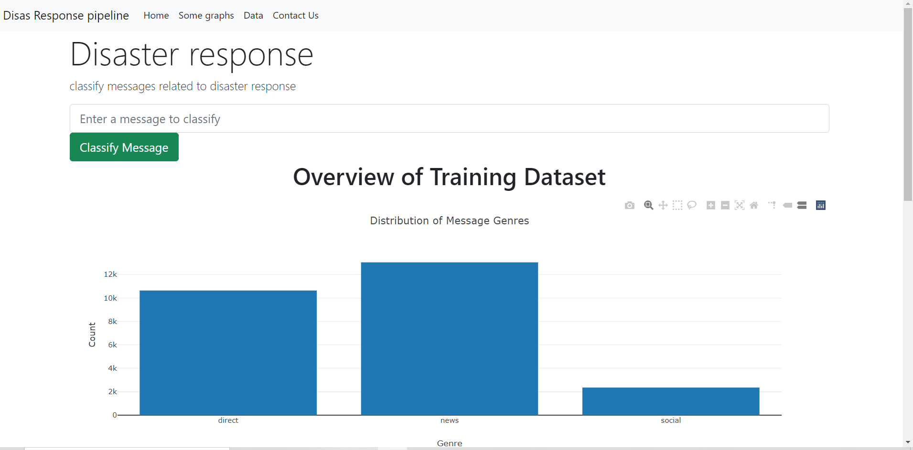
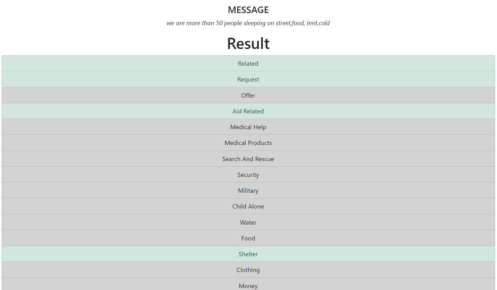

# Disaster response Pipeline
## Overview
A web app that classify messages related to disaster response usig machine learning pipeline(knn , cv) so that you can send the messages to an appropriate disaster relief agency.

## Instructions
1. ### install Dependencies
   > Numpy, Pandas, nltk, plotly, pickle, sqlalchemy
2. ### generate Database
   > run ETL pipeline 
        `python data/process_data.py data/disaster_messages.csv data/disaster_categories.csv data/DisasterResponse.db`
3. ### Train classifier
    > `python models/train_classifier.py data/DisasterResponse.db models/classifier.pkl`
4. ### Run web app.
   >`python app.**py`

## Results:

